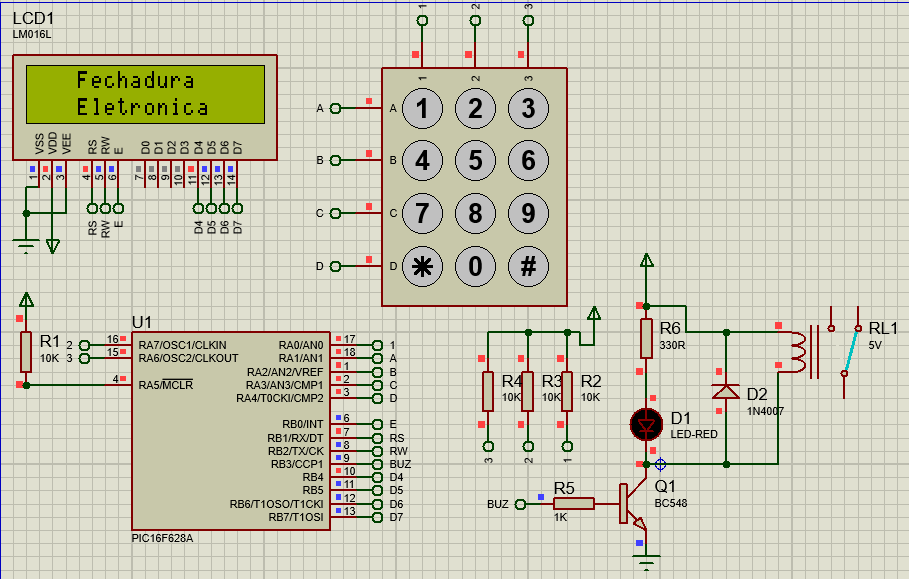

# FechaduraComsenhaPIC
Projeto de uma fechadura controlada com micro controlador PIC, onde ao digitar a senha correta 
e pressionar # ela e liberada, no caso de a senha estar incorreta será mostrado um aviso no display
indicando que a senha esta erra pressionando o * limpa a senha e serve para mudar o estado do rele 
de saída.

